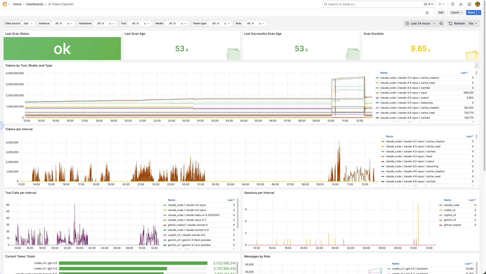
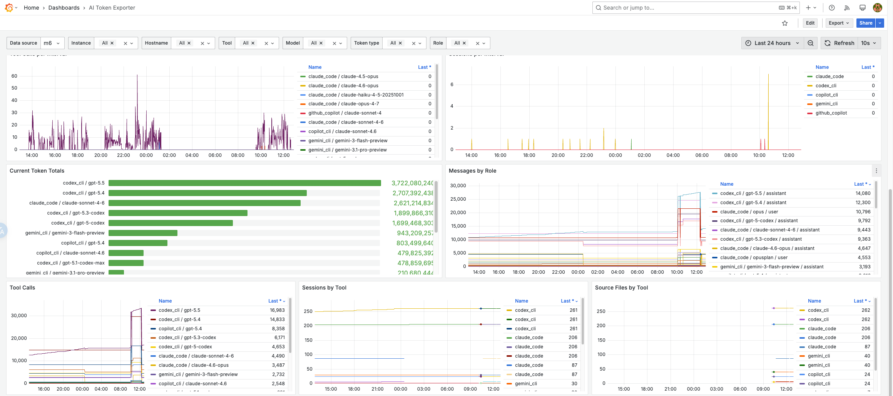

# ai-token-exporter

`ai-token-exporter` exposes local AI coding tool token usage as Prometheus metrics.

It reads session logs from:

- Claude Code
- Codex CLI
- Gemini CLI
- Antigravity CLI (`agy`)
- GitHub Copilot CLI
- GitHub Copilot Chat sessions from VS Code-compatible editors

The exporter keeps an in-memory snapshot and serves it at `GET /metrics`. Scrapes do not read session files from disk.

## Install

### Binary Release

Download a prebuilt archive from the GitHub release page. Replace `linux_amd64` with the target platform, such as `linux_arm64`, `darwin_arm64`, or `windows_amd64`.

```bash
curl -L https://github.com/jimyag/ai-token-exporter/releases/latest/download/ai-token-exporter_linux_amd64.tar.gz \
  -o ai-token-exporter_linux_amd64.tar.gz
tar -xzf ai-token-exporter_linux_amd64.tar.gz
install -m 0755 ai-token-exporter /usr/local/bin/ai-token-exporter
```

### Docker

```bash
docker run --rm -p 9108:9108 \
  -v "$HOME/.claude:/home/nonroot/.claude:ro" \
  -v "$HOME/.codex:/home/nonroot/.codex:ro" \
  -v "$HOME/.gemini:/home/nonroot/.gemini:ro" \
  -v "$HOME/.copilot:/home/nonroot/.copilot:ro" \
  -v "$HOME/Library/Application Support:/home/nonroot/.config:ro" \
  ghcr.io/jimyag/ai-token-exporter:latest
```

On Linux, mount `$HOME/.config` instead of the macOS application support directory:

```bash
docker run --rm -p 9108:9108 \
  -v "$HOME/.claude:/home/nonroot/.claude:ro" \
  -v "$HOME/.codex:/home/nonroot/.codex:ro" \
  -v "$HOME/.gemini:/home/nonroot/.gemini:ro" \
  -v "$HOME/.copilot:/home/nonroot/.copilot:ro" \
  -v "$HOME/.config:/home/nonroot/.config:ro" \
  ghcr.io/jimyag/ai-token-exporter:latest
```

### Go Install

```bash
go install github.com/jimyag/ai-token-exporter/cmd/ai-token-exporter@latest
```

### Source Build

```bash
git clone https://github.com/jimyag/ai-token-exporter.git
cd ai-token-exporter
go build -trimpath -buildvcs=true -o bin/ai-token-exporter ./cmd/ai-token-exporter
```

With Task:

```bash
task build
```

## Usage

```bash
ai-token-exporter \
  --listen=:9108 \
  --scan-interval=30s \
  --enabled=claude_code,codex_cli,copilot_cli,github_copilot,gemini_cli,agy
```

All flags are optional. The default listen address is `:9108`, the default scan interval is `30s`, and all supported analyzers are enabled by default.

Check metrics:

```bash
curl localhost:9108/metrics
```

Show version metadata:

```bash
ai-token-exporter --version
```

`--version` is provided by `github.com/jimmicro/version`. Release builds inject the git tag and build time through GoReleaser ldflags.

## Configuration

Flags can be set with environment variables:

| Flag                  | Environment variable                  | Default                                                                                                                  |
| --------------------- | ------------------------------------- | ------------------------------------------------------------------------------------------------------------------------ |
| `--listen`            | `AI_TOKEN_EXPORTER_LISTEN`            | `:9108`                                                                                                                  |
| `--scan-interval`     | `AI_TOKEN_EXPORTER_SCAN_INTERVAL`     | `30s`                                                                                                                    |
| `--enabled`           | `AI_TOKEN_EXPORTER_ENABLED`           | `claude_code,codex_cli,copilot_cli,github_copilot,gemini_cli,agy`                                                        |
| `--claude-dir`        | `AI_TOKEN_EXPORTER_CLAUDE_DIR`        | `~/.claude/projects`                                                                                                     |
| `--codex-dir`         | `AI_TOKEN_EXPORTER_CODEX_DIR`         | `~/.codex`                                                                                                               |
| `--copilot-dir`       | `AI_TOKEN_EXPORTER_COPILOT_DIR`       | `~/.copilot`                                                                                                             |
| `--gemini-dir`        | `AI_TOKEN_EXPORTER_GEMINI_DIR`        | `~/.gemini/tmp`                                                                                                          |
| `--gemini-config-dir` | `AI_TOKEN_EXPORTER_GEMINI_CONFIG_DIR` | `~/.gemini`                                                                                                              |
| `--agy-dir`           | `AI_TOKEN_EXPORTER_AGY_DIR`           | `~/.gemini/antigravity-cli/conversations`                                                                                |
| `--vscode-config-dir` | `AI_TOKEN_EXPORTER_VSCODE_CONFIG_DIR` | `os.UserConfigDir()`; for example `~/Library/Application Support` on macOS, `~/.config` on Linux, `%APPDATA%` on Windows |

Default source locations:

- Claude Code: `~/.claude/projects/*/*.jsonl`
- Codex CLI: `~/.codex/sessions/**/*.jsonl` and `~/.codex/archived_sessions/**/*.jsonl`
- Gemini CLI: `~/.gemini/tmp/**/chats/*.{json,jsonl}`
- Antigravity CLI (`agy`): `~/.gemini/antigravity-cli/conversations/**/*.db`
- Copilot CLI: `~/.copilot/session-state/**/*.jsonl`, `~/.copilot/history-session-state/**/*.jsonl`
- GitHub Copilot Chat: `{user config dir}/{Code,Code - Insiders,Cursor,Windsurf,VSCodium,Positron,Antigravity}/User/workspaceStorage/*/chatSessions/*.json`

## Metrics

All usage metrics are gauges because local log snapshots can decrease when files are removed, compacted, or de-duplicated differently.

```prometheus
ai_token_exporter_tokens{tool,model,token_type}
ai_token_exporter_messages{tool,model,role}
ai_token_exporter_tool_calls{tool,model}
ai_token_exporter_sessions{tool}
ai_token_exporter_source_files{tool}
ai_token_exporter_source_parse_errors{tool}
ai_token_exporter_scan_cache_hits{tool}
ai_token_exporter_scan_cache_misses{tool}
ai_token_exporter_last_scan_timestamp_seconds
ai_token_exporter_last_successful_scan_timestamp_seconds
ai_token_exporter_scan_duration_seconds
ai_token_exporter_last_scan_success
ai_token_exporter_build_info{version,commit}
```

Label values:

- `tool`: `claude_code`, `codex_cli`, `copilot_cli`, `github_copilot`, `gemini_cli`
- `token_type`: `input`, `output`, `reasoning`, `cache_creation`, `cache_read`, `cached`
- `role`: `user`, `assistant`
- `model`: normalized model name, falling back through tool defaults before `unknown`

`input` is gross input, including cached input when the source reports it. `cached` is cache hit/reused input and does not include cache creation.

Session and project identifiers are intentionally not exposed as labels. The exporter aggregates those locally into `tool` and `model` series to keep Prometheus cardinality low.

The scanner keeps compact per-file aggregates in memory and reparses only new or changed files. Cache entries contain file metadata, aggregate counters, and session IDs; raw log contents and parsed records are not retained. SQLite WAL metadata is included when checking database sources. The first scan after a restart is always a full scan.

## Prometheus / VictoriaMetrics Scrape

Prometheus and VictoriaMetrics can scrape the same `/metrics` endpoint. The exporter does not add `instance`, `job`, or host labels itself; those usually come from the scrape config.

Single-node example:

```yaml
scrape_configs:
  - job_name: ai-token-exporter
    static_configs:
      - targets: ["localhost:9108"]
        labels:
          hostname: "local-dev"
```

Multi-node example. Keep the labels used by live scrapes and historical backfills aligned. The dashboard filters by `hostname`; if you also use a custom label such as `nodename`, keep both labels on the scrape target:

```yaml
scrape_configs:
  - job_name: ai-token-exporter
    static_configs:
      - targets: ["192.0.2.10:21112"]
        labels:
          hostname: "node-a"
          nodename: "node-a"
      - targets: ["192.0.2.11:21112"]
        labels:
          hostname: "node-b"
          nodename: "node-b"
```

For VictoriaMetrics single-node deployments, pass the same YAML file to `-promscrape.config`:

```bash
victoria-metrics-prod \
  -storageDataPath=/var/lib/victoria-metrics \
  -retentionPeriod=12 \
  -promscrape.config=/etc/victoria-metrics/promscrape.yml
```

## VictoriaMetrics Backfill

`backfill` replays parsed log records by timestamp and writes cumulative historical samples in VictoriaMetrics' Prometheus import format. This is useful when a fresh VM/Grafana setup would otherwise start with today's full snapshot and no earlier points.

VictoriaMetrics documents this endpoint as [`POST /api/v1/import/prometheus`](https://docs.victoriametrics.com/victoriametrics/#how-to-import-data-in-prometheus-exposition-format); each imported line may include an explicit timestamp.

Preview the import text:

```bash
ai-token-exporter backfill \
  --from=2026-05-01T00:00:00+08:00 \
  --to=2026-05-16T00:00:00+08:00 \
  --step=1m \
  --job=ai-token-exporter \
  --instance=192.0.2.10:21112 \
  --hostname=workstation-a
```

Import into VictoriaMetrics. By default, this replaces existing `ai-token-exporter` data for the same `job`, `instance`, and `hostname` before importing:

```bash
ai-token-exporter backfill \
  --vm-url=http://victoriametrics:8428/api/v1/import/prometheus \
  --job=ai-token-exporter \
  --instance=192.0.2.10:21112 \
  --hostname=workstation-a
```

Append without deleting existing series:

```bash
ai-token-exporter backfill \
  --replace-existing=false \
  --vm-url=http://victoriametrics:8428/api/v1/import/prometheus \
  --job=ai-token-exporter \
  --instance=192.0.2.10:21112 \
  --hostname=workstation-a
```

The default replacement path deletes only series matching `{__name__=~"ai_token_exporter_.*",job=...,instance=...,hostname=...}` after the import file is generated successfully and before it is posted to VictoriaMetrics. For VictoriaMetrics cluster deployments, pass `--delete-url` if the delete endpoint is not reachable at the URL inferred from `--vm-url`.

Set `--instance` and `--hostname` to the same labels used by your scrape config so Grafana filters match live and backfilled data. The backfill imports usage series, message counts, tool calls, sessions, and build info; scan health/source-file metrics remain live-only.

Example commands for a shared VictoriaMetrics endpoint. Run each command on the matching node so the exporter reads that node's local AI tool logs:

```bash
# node-a
ai-token-exporter backfill \
  --vm-url=https://vm.example.com/api/v1/import/prometheus \
  --job=ai-token-exporter \
  --instance=192.0.2.10:21112 \
  --hostname=node-a

# node-b
ai-token-exporter backfill \
  --vm-url=https://vm.example.com/api/v1/import/prometheus \
  --job=ai-token-exporter \
  --instance=192.0.2.11:21112 \
  --hostname=node-b
```

The `--instance` value must match the scrape target label exactly. If live scrape uses `instance="192.0.2.10:21112"`, backfill should use the same value; otherwise Grafana will show historical and live data as different series.

## Grafana

Import `dashboard/ai-token-exporter.json` into Grafana. The dashboard includes datasource, instance, hostname, tool, model, token type, and role filters.





## Release

Releases are published when pushing a tag that starts with `v`.

```bash
git tag v0.1.0
git push origin v0.1.0
```

The release workflow uses GoReleaser to publish:

- Linux, macOS, and Windows binaries for `amd64` and `arm64`
- GitHub release archives containing only the `ai-token-exporter` binary
- Standalone Grafana dashboard asset: `ai-token-exporter-dashboard.json`
- Multi-arch container image: `ghcr.io/jimyag/ai-token-exporter:<tag>` and `latest`

Local release dry-run:

```bash
goreleaser release --snapshot --clean
```

## Development

```bash
go test ./...
go vet ./...
```

With Task:

```bash
task deps
task lint
task test
task build
task run -- --listen=:9108
task backfill -- --vm-url=http://localhost:8428/api/v1/import/prometheus
task docker-build
task release-snapshot
```
